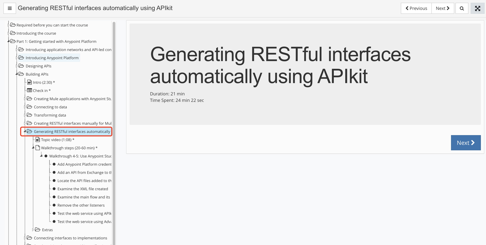
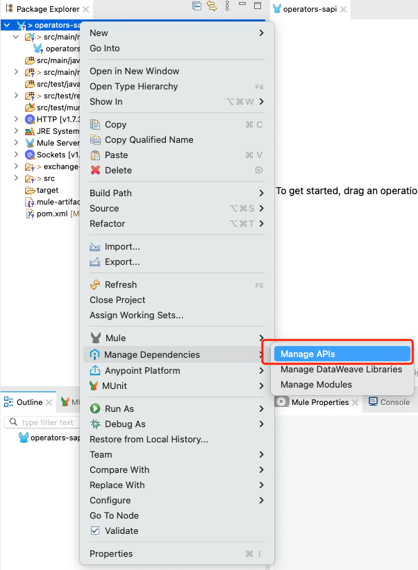
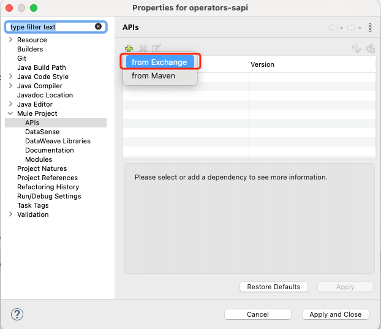
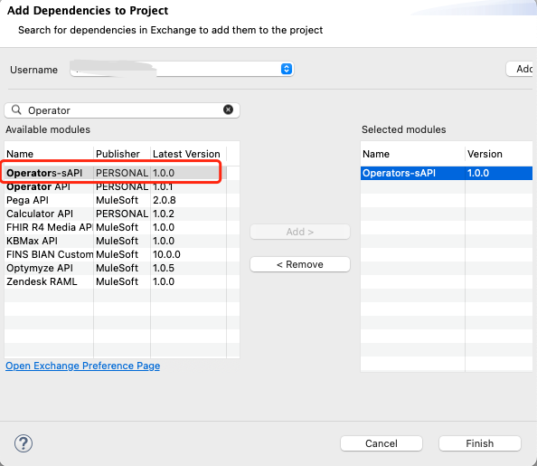
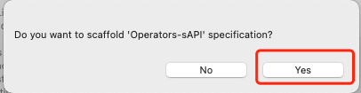

## Part 1 > Building APIs

&nbsp;

### Generating RESTful interfaces automatically using APIkit

&nbsp;

### Steps

1. Create Mule project from anypoint studio

2. Right-click the project and select Manage Dependencies > Manage APIs
	

3. In the Properties for training4-american-wsdialog box, click the Add button and select from Exchange
	

4. In the Add Dependencies to Project dialog box, enter "Operator" in the search field and choose the correct one and correct version
	

	
